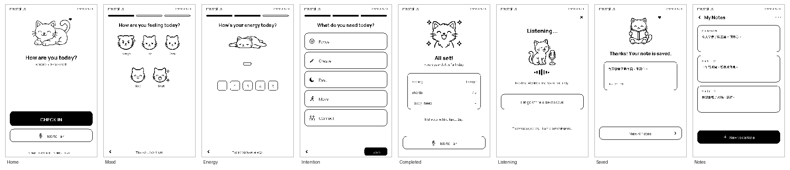
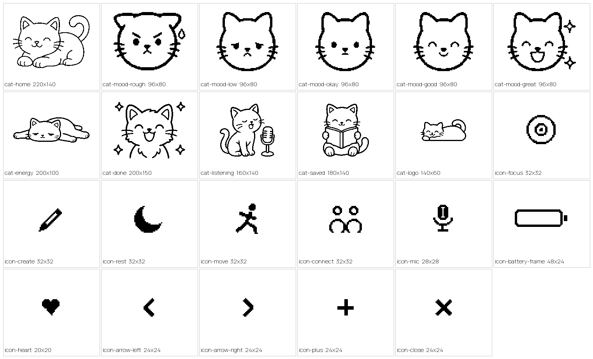

# sticky-mood · me.status

> 一个跑在 **Seeed reTerminal Sticky**（3.97" 磁吸墨水屏，ESP32-S3）上的**触屏心情/状态记录**应用。
> 每天 5 秒钟，对着墙上的墨水屏回答"今天感觉如何"。



**当前状态**：UI + 状态机 + 硬件诊断模式已完成，固件用 ESP-IDF 交叉编译通过；
同一份 UI 代码在电脑上的**模拟器**里可点击走通全部 615 个状态。真机验证（SD / 麦克风 / 按键 / RTC）
已做成内置诊断菜单，等待借测。

---

## 这是什么

`me.status` 是一个**纯触屏**的心情与状态记录器，替代我在手机「健康」App 里记心情的习惯。

- 首页问 **"How are you today?"**，依次选 **心情 → 精力 → 今天的意向**，三步完成一次记录；
- 记完进入 **Completed** 页并常驻待机，墨水屏断电也保留最后一帧——它是一块"今天的状态牌"；
- 长按 AI 键可以**录一段语音笔记**，转成文字和录音一起存到 SD 卡，可回看最近三个月；
- 全程 1-bit 黑白、圆体字 + 手绘猫咪插画，安静、无通知、不打扰。

它不是手机 App 的复刻，而是一个**环境式（ambient）设备**：挂在墙上/冰箱上，抬眼就能看到、碰一下就能记，
把"记录心情"从打开 App 的负担变成一个 5 秒的仪式。

## 为什么做这个

我在 iPhone「健康」里记心情坚持不下来：入口太深、步骤太多、记完没有任何反馈。
我想验证一个假设——**把记录的摩擦降到接近零，并且让"记过"这件事被看见**，人就会坚持下去。

墨水屏恰好适合：常显不耗电、没有通知和蓝光、天然"慢"，和"停下来关照自己一下"的产品气质吻合。
Seeed 的 reTerminal Sticky 是一块带触摸、麦克风、SD 卡和电池的成品墨水屏开发板，
让我可以**不画 PCB、不焊板子**，把精力全部放在产品体验和固件上。

## 硬件清单

整机就是一块开发板，无需额外焊接：

| 部件 | 规格 | 用途 |
|---|---|---|
| **Seeed reTerminal Sticky** | ESP32-S3R8（双核 LX7 @240 MHz，8 MB PSRAM / 32 MB flash） | 主控 |
| 墨水屏 | 3.97" SSD1677，原生 800×480，1-bit 黑白 + 4 级灰度 | 显示（竖屏 480×800 使用） |
| 触摸 | GT911 电容触摸（I2C0） | 全部交互 |
| 麦克风 | PDM 麦克风 | 语音笔记 |
| 存储 | microSD（SPI，与屏幕共用 SPI2） | 心情记录 + 语音笔记持久化 |
| RTC | PCF8563（I2C1） | 日期/时间 |
| 电源 | 750 mAh 锂电 + BQ27220 电量计 + BQ25616 充电，USB-C | 供电 |
| 按键 | AI/电源、上、下 | 电源 + 诊断模式入口 |

另需：一张 microSD 卡（存数据）、一根 USB-C 线（烧录/供电）。
完整 GPIO 映射、总线拓扑与电源自锁电路见 [`docs/HARDWARE.md`](docs/HARDWARE.md)。

## 功能演示

**① 8 页交互流程**（上图）。这张图不是设计稿，而是**固件里那份 UI 代码在电脑上真实渲染**出来的逐帧输出——
设备烧录后画的就是这些像素。

**② 可点击的网页模拟器**。同一份 C++ 页面代码被编译进一个 host 模拟器，它会**广度优先遍历整个状态机**
（615 个可达状态），生成一个单文件、可点击的网页预览：`tools/sim/` → `build/sim/index.html`。
也就是说，在没有真机的情况下，整套交互逻辑已经在电脑上被完整走查过一遍。

**③ 全部视觉资产为 1-bit 手工管线产出**（11 只猫 + 12 个图标 + 中英文点阵字库）：



**④ 真机照片 / 运行视频**：手上暂无实体机，正在向 Seeed 借测；
借测回来后会把真机实拍和刷新过程视频补进这里。诊断模式（开机按住 UP 键）
会把 SD / 麦克风 / RTC / 按键 / 触摸的实测结果直接显示在墨水屏上。

## 技术说明

**语言 / 框架**：C++（gnu++2b）+ **ESP-IDF v5.4** + FreeRTOS。
显示与触摸复用 Playground Registry 里 `sticky-2048` 的开源驱动组件（`seeed_epaper`、`gt911`）。

**固件架构**——最关键的一个设计是**把 UI 层做成零 ESP-IDF 依赖的纯 C++**：

```
main/ui      1-bit 帧缓冲 / 点阵字库 / 精灵渲染   （不 include 任何 ESP-IDF 头）
main/pages   8 页渲染 + 热区 + 状态机            （纯 C++，只读 AppState）
main/app     AppState、资源装载
main/hardware  面板(旋转+反色) / 触摸(坐标反变换)
main/diag    开机按住 UP 进入的服务模式：SD/麦克风/RTC/电源/按键/触摸 六项硬件自检
```

因为 UI 层不碰硬件，**同一份 `pages/*.cpp` 既能编译进固件、也能在电脑上编译**，
于是才有了上面那个可点击模拟器——UI 逻辑的验证不依赖真机。

几条硬规则：

- **页面只读 AppState，绝不直接碰硬件**；输入统一走 `pages::on_tap` 事件。
- **旋转与反色只实现在一处**（`StickyDisplay::draw_pixel` / `blit_ui`），触摸做匹配的反变换；
  面板原生 800×480 横屏，软件旋转 270° + `mirror_x` 得到竖屏 480×800。
- **刷新策略**：换页全刷、增量局部刷，每 20 次局部刷强制一次全刷压残影；
  全刷耗时以秒计，绝不在 ISR/回调里调用。
- **电源自锁**：`POWER_HOLD`(45) + `POWER_LOCK`(46) 脉冲锁存主电源轨，必须是 `app_main()` 第一句。

**资产管线**（`tools/`）：OFL 字体（Manrope / GenSenRounded2 等）→ 自研 1-bit 点阵 blob；
AI 线稿 → 后处理成 1-bit 精灵；全部由 `tools/build_assets.sh` 生成、内嵌进固件。

**构建**：

```bash
bash tools/build_assets.sh      # 生成字体/精灵 blob
. ~/esp/esp-idf/export.sh       # ESP-IDF v5.4
idf.py build
idf.py -p /dev/cu.usbmodem* flash monitor
```

更多细节：[`docs/HARDWARE.md`](docs/HARDWARE.md)（硬件/引脚/刷新）、
[`docs/REQUIREMENTS.md`](docs/REQUIREMENTS.md)（需求与决议）、
[`docs/FEASIBILITY.md`](docs/FEASIBILITY.md)（可行度与功耗预算）、
[`docs/QUESTIONS-FOR-SEEED.md`](docs/QUESTIONS-FOR-SEEED.md)（待验证的硬件问题清单）。

## 许可证

MIT，见 [LICENSE](LICENSE)。`components/` 下第三方代码保留各自许可证，见 [components/VENDORED.md](components/VENDORED.md)。
字体与插画均为 OFL / 自制，见 [`assets/fonts/README.md`](assets/fonts/README.md)。
